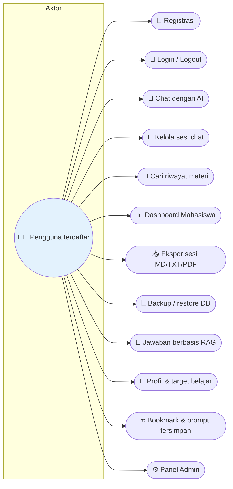
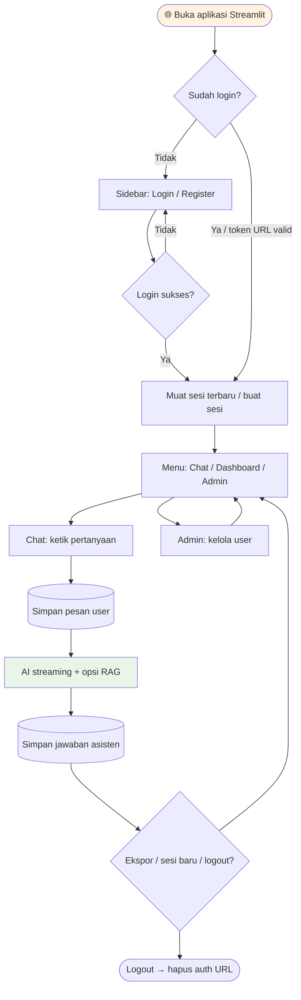
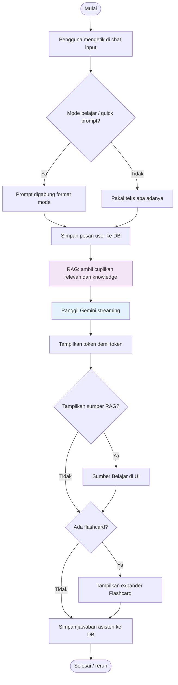
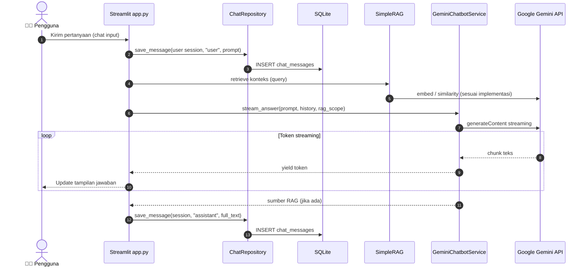
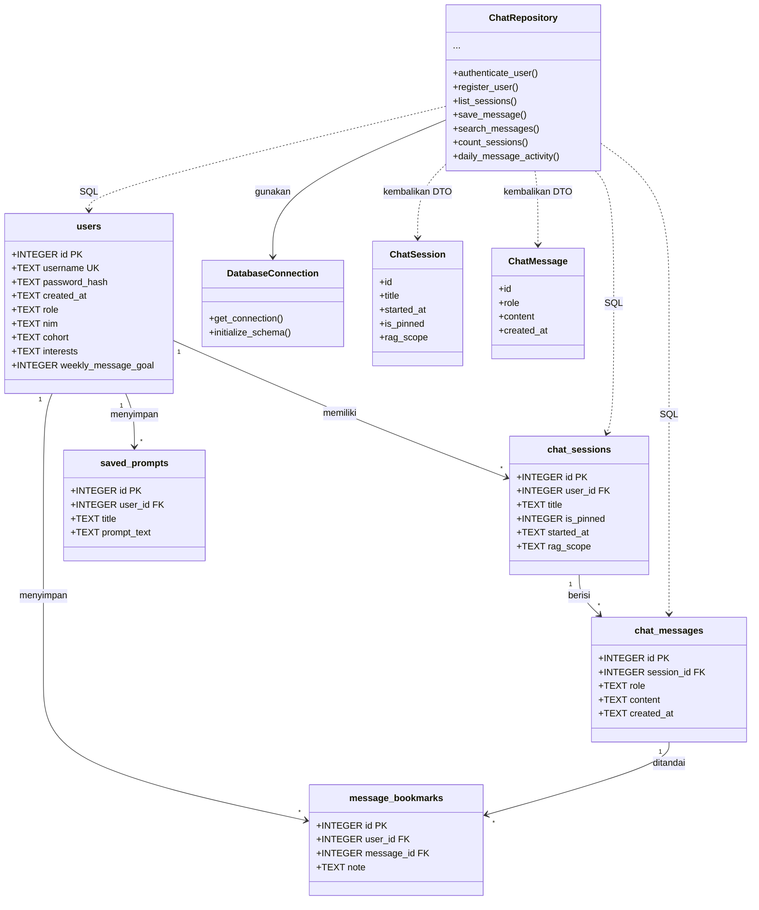
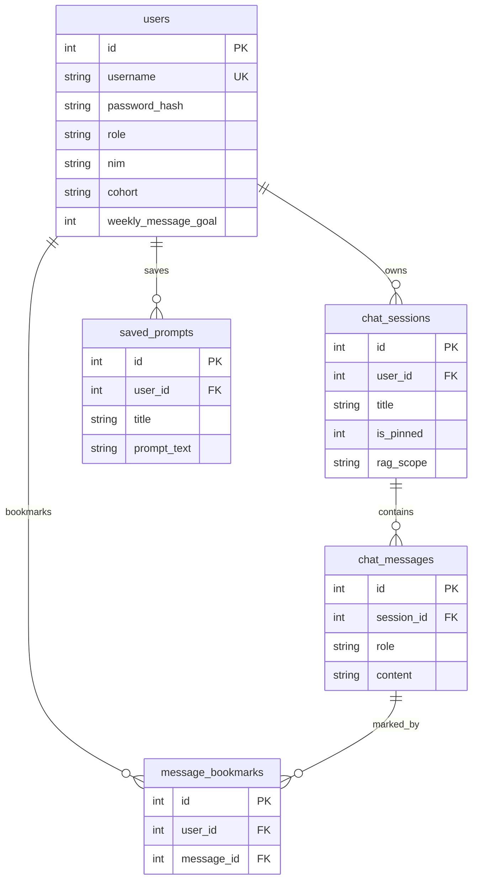
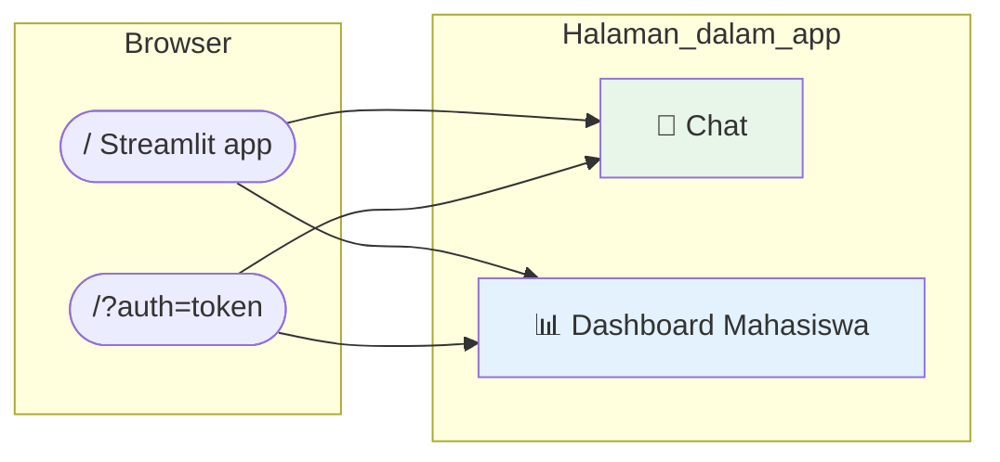

# 📚 Dokumentasi Sistem — Chatbot Konsultasi Pelajaran STT-NF

**Versi aplikasi:** Streamlit single-app · **Basis data:** SQLite · **AI:** Google Gemini + RAG lokal

*Gaya visual badge mengikuti README GitHub modern (mis. proyek referensi [absensi-system](https://github.com/SulthanRaghib/absensi-system)).*

---

## 📑 Daftar isi

| Bagian | Topik |
|:------:|-------|
| [🔑](#-1-informasi-akun-login) | Informasi akun login |
| [🎯](#-2-use-case-user-flow--diagram) | Use case, user flow, activity, sequence, class diagram |
| [🗄️](#-3-skema-database) | Skema database |
| [👥](#-4-modul-pengguna-dan-administrator) | Modul pengguna & administrator |
| [🔐](#-5-logika-keamanan) | Logika keamanan |
| [🛤️](#-6-rute--alur-navigasi-aplikasi) | Rute & navigasi aplikasi |
| [📎](#-kaitan-dokumen-lain) | Kaitan dokumen lain |

---

## 🔑 1. Informasi akun login

| Item | Penjelasan |
|------|------------|
| **Registrasi** | Pengguna baru membuat akun lewat tab **Register** di sidebar (`Username` minimal 3 karakter, `Password` minimal 6 karakter). |
| **Login** | Tab **Login** di sidebar; setelah sukses, sesi Streamlit menandai pengguna terautentikasi dan URL dapat memuat parameter `?auth=...` untuk persistensi. |
| **Akun uji (opsional)** | Jika akun demo sudah pernah dibuat di mesin Anda: **Username:** `tester_edu` · **Password:** `Test12345` *(sesuaikan jika Anda mengubahnya di database)*. |
| **Belum punya akun** | Gunakan **Daftar** terlebih dahulu; tidak ada akun bawaan otomatis di kode. |

> ⚠️ **Privasi:** Jangan membagikan kata sandi atau file `data/app.db` ke publik. Untuk demo skripsi, gunakan akun khusus pengujian.

---

## 🎯 2. Use case, user flow, & diagram

### 2.1 Diagram use case (ringkas)

### 2.2 User flow (ringkas — dari buka aplikasi sampai chat)

### 2.3 Activity diagram — mengirim satu pertanyaan chat

### 2.4 Sequence diagram — satu siklus pertanyaan–jawaban

### 2.5 Class diagram — lapisan basis data & repositori

> Diagram ini memetakan **entitas tabel** dan kelas Python utama yang mengakses data (bukan diagram UML seluruh aplikasi).

---

## 🗄️ 3. Skema database

Berikut definisi logis yang dipakai aplikasi (sumber: `src/database/schema.sql`). Foreign key aktif (`PRAGMA foreign_keys = ON`).

### 3.1 Tabel `users`

| Kolom | Tipe | Keterangan |
|-------|------|------------|
| `id` | INTEGER PK AUTOINCREMENT | Identitas unik pengguna |
| `username` | TEXT NOT NULL UNIQUE | Nama login |
| `password_hash` | TEXT NOT NULL | Hash kata sandi |
| `created_at` | TEXT DEFAULT CURRENT_TIMESTAMP | Waktu pendaftaran |
| `role` | TEXT NOT NULL DEFAULT `user` | `user` atau `admin` |
| `nim` | TEXT | NIM (opsional) |
| `cohort` | TEXT | Angkatan (opsional) |
| `interests` | TEXT | Minat/topik (opsional) |
| `weekly_message_goal` | INTEGER DEFAULT 12 | Target pesan/minggu (dashboard) |

### 3.2 Tabel `chat_sessions`

| Kolom | Tipe | Keterangan |
|-------|------|------------|
| `id` | INTEGER PK AUTOINCREMENT | ID sesi |
| `user_id` | INTEGER NOT NULL FK → `users(id)` ON DELETE CASCADE | Pemilik |
| `title` | TEXT | Judul sesi |
| `is_pinned` | INTEGER NOT NULL DEFAULT 0 | Pin (0/1) |
| `started_at` | TEXT DEFAULT CURRENT_TIMESTAMP | Awal sesi |
| `rag_scope` | TEXT NOT NULL DEFAULT `all` | `all` atau `sttnf` (filter nama berkas RAG) |

### 3.3 Tabel `chat_messages`

| Kolom | Tipe | Keterangan |
|-------|------|------------|
| `id` | INTEGER PK AUTOINCREMENT | ID pesan |
| `session_id` | INTEGER NOT NULL FK → `chat_sessions(id)` ON DELETE CASCADE | Sesi induk |
| `role` | TEXT CHECK IN ('user','assistant') | Peran pesan chat |
| `content` | TEXT NOT NULL | Isi pesan |
| `created_at` | TEXT DEFAULT CURRENT_TIMESTAMP | Waktu simpan |

### 3.4 Tabel `saved_prompts`

| Kolom | Tipe | Keterangan |
|-------|------|------------|
| `id` | INTEGER PK AUTOINCREMENT | ID |
| `user_id` | INTEGER NOT NULL FK → `users(id)` ON DELETE CASCADE | Pemilik |
| `title` | TEXT NOT NULL | Judul ringkas |
| `prompt_text` | TEXT NOT NULL | Teks prompt |
| `created_at` | TEXT DEFAULT CURRENT_TIMESTAMP | Dibuat |

### 3.5 Tabel `message_bookmarks`

| Kolom | Tipe | Keterangan |
|-------|------|------------|
| `id` | INTEGER PK AUTOINCREMENT | ID bookmark |
| `user_id` | INTEGER NOT NULL FK → `users(id)` ON DELETE CASCADE | Pemilik |
| `message_id` | INTEGER NOT NULL FK → `chat_messages(id)` ON DELETE CASCADE | Pesan yang ditandai |
| `note` | TEXT | Catatan opsional |
| `created_at` | TEXT DEFAULT CURRENT_TIMESTAMP | Dibuat |

**Unik:** kombinasi `(user_id, message_id)`.

### 3.6 Indeks

- `idx_chat_sessions_user_id`, `idx_chat_messages_session_id`
- `idx_saved_prompts_user_id`, `idx_message_bookmarks_user_id`

### 3.7 Diagram relasi (ER ringkas)

---

## 👥 4. Modul pengguna dan administrator

### 4.1 Modul pengguna (🧑‍🎓 dalam aplikasi)

Semua fitur berikut memerlukan **login**; data dibatasi per `user_id`.

| Area | Fitur |
|------|--------|
| **Autentikasi** | Register, login, logout, refresh; persistensi lewat query `auth` |
| **Preferensi** | Tema Light/Dark, menu Chat / Dashboard Mahasiswa |
| **Chat** | Input pertanyaan, mode belajar, quick prompt, streaming jawaban, flashcard |
| **Sesi** | Buat/pilih sesi, rename, pin, hapus, cari riwayat |
| **RAG** | Konteks dari `data/knowledge` (+ `uploads/`), filter `rag_scope`, kutipan sumber di jawaban |
| **Ekspor** | Unduh sesi aktif: `.md`, `.txt`, `.pdf` |
| **Dashboard Mahasiswa** | Target mingguan (DB), sesi pin, materi RAG, statistik, grafik & frekuensi sumber RAG |
| **Alat sidebar** | Profil, prompt tersimpan, bookmark, unggah PDF, filter RAG sesi; pengingat idle |
| **Data** | Backup/restore SQLite dari sidebar; skrip `scripts/backup_sqlite.py` |

### 4.2 Modul administrator (panel dalam aplikasi)

| Status | Penjelasan |
|--------|------------|
| **✅ Tersedia** | Menu **Admin** (sidebar) untuk pengguna dengan `role = 'admin'`. Menampilkan statistik global, daftar pengguna, pengaturan password, dan perubahan role (`user` / `admin`). |
| **Menjadi admin pertama** | Set `ADMIN_USERNAMES` di `.env` (username dipisah koma, sama persis dengan username login). Saat aplikasi start, user tersebut dipromosikan ke admin. Tanpa itu, naikkan role lewat SQL manual atau lewat admin lain. |
| **Hak akses mahasiswa** | Pengguna biasa hanya mengakses **sesi dan pesan miliknya**; admin mengelola akun dari panel terpisah. |
| **Administrasi teknis** | Backup DB, refresh indeks RAG, dan unggah knowledge bisa juga lewat skrip / folder `data/knowledge` oleh operator. |

---

## 🔐 5. Logika keamanan

| Aspek | Implementasi pada proyek ini |
|------|------------------------------|
| **Kata sandi** | Disimpan sebagai **hash** (`passlib`, skema `pbkdf2_sha256`), bukan teks jelas. |
| **Autentikasi sesi** | Setelah login sukses, `st.session_state` menyimpan `user_id` dan `username`. |
| **Token URL** | Token `?auth=` dibentuk dari `user_id`, `username`, dan **HMAC-SHA256** dengan rahasia `AUTH_SECRET_KEY`. Verifikasi memakai `hmac.compare_digest` (anti timing attack). |
| **Validasi token** | Token hanya diterima jika signature cocok **dan** pengguna masih ada di DB dengan username yang sama. |
| **Logout** | Mereset state dan **menghapus** parameter `auth` dari URL. |
| **API Gemini** | Kunci `GEMINI_API_KEY` hanya di server/environment (`.env`), tidak dikirim ke browser sebagai nilai teks di UI. |
| **Isolasi data** | Query repositori menyertakan `user_id` / join ke sesi milik pengguna agar tidak membaca data pengguna lain. |
| **File upload (PDF)** | PDF diunggah dari UI → teks diekstrak ke `data/knowledge/uploads/*.txt` lalu indeks embedding diperbarui; batasi izin folder di produksi. |
| **Logging** | Event ringan (mis. login sukses) ke `logs/app.log`; tidak mencatat isi password. |

---

## 🛤️ 6. Rute & alur navigasi aplikasi

Aplikasi ini adalah **satu skrip Streamlit** (`app.py`), **bukan** backend REST dengan banyak endpoint. Yang ada adalah **alur halaman logis** dan **parameter URL**.

### 6.1 Navigasi utama (sidebar)

| Rute logis | Deskripsi |
|------------|-----------|
| **Chat** | Hero, toolbar, riwayat + bookmark per pesan, input chat, session tools, expander mahasiswa di sidebar |
| **Dashboard Mahasiswa** | Statistik, target 7 hari (DB), pin, knowledge, frekuensi sumber RAG |
| **Admin** | Statistik global, daftar user, reset password, ubah role (hanya jika `role=admin`) |

### 6.2 URL & query

| Pola | Fungsi |
|------|--------|
| `http://localhost:8501/` | Halaman default aplikasi |
| `http://localhost:8501/?auth=<token>` | Memulihkan sesi login via token bertanda tangan (jika valid) |

Menu sidebar (widget `radio`, key `main_menu_v3`): **Chat**, **Dashboard Mahasiswa**, dan **Admin** (jika pengguna admin).

### 6.3 Bukan “rute API” klasik

Tidak ada pemetaan seperti `/api/chat` atau `/login` terpisah: semua interaksi melalui **widget Streamlit** (tombol, input, `st.rerun()`).

---

## 📎 Kaitan dokumen lain

| Dokumen | Isi singkat |
|---------|----------------|
| [README.md](README.md) | Gambaran proyek, instalasi, struktur folder |
| [CARA_JALANKAN.md](CARA_JALANKAN.md) | Menjalankan `streamlit run app.py` |
| [PANDUAN_INSTALASI_AYUB.md](PANDUAN_INSTALASI_AYUB.md) | Laragon + Cursor dari awal |
| [TROUBLESHOOTING.md](TROUBLESHOOTING.md) | Error API, login, model |

---

**📌 Dokumen ini dapat disalin ke laporan/skripsi** (diagram Mermaid dapat dirender di GitHub, GitLab, VS Code, atau diekspor ke gambar lewat extension Mermaid).

Made with documentation best practices · **Academic Assistant STT-NF**

